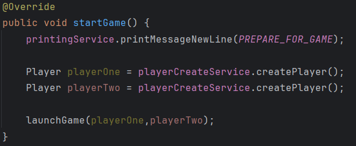
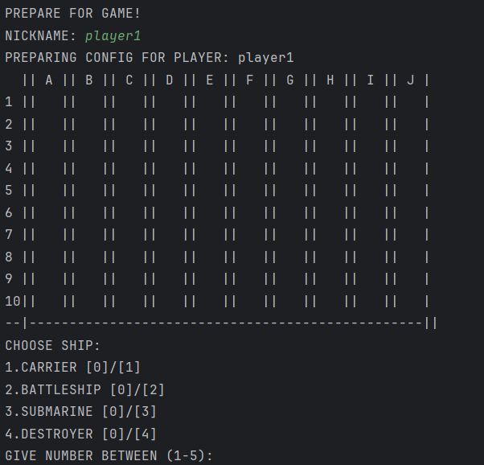

# BattleshipConsoleGame
This is console-based project of classic game - Battleship

## How game works?

#### Game start
Method [startGame()](./src/main/java/com/battleship/Main.java) starts game.

Then player map configuration begins, where we choose player nickname and add player ships to the map

### Player ships

#### Player board
Player [Board](./src/main/java/com/battleship/model/Board.java) is an object consist of map and warships. It's instantiated when player is created ([PlayerCreateServiceImpl](./src/main/java/com/battleship/services/PlayerCreateServiceImpl.java)). Each player has two maps - his board and shoot map which represents area where player shoot.
Map represents a "GUI" for player, as below:

To add ship to the board we choose number between (1-5). When we chose number we set points where ship should be placed.

Position is passed as a pattern (`NUMBER+LETTER`), e.g. `1A`. We set the start point and end point. Length between those points must be the length of selected ship we set on the board. If it's not, then ship is not placed.

- class [PointValidatorImpl](./src/main/java/com/battleship/services/PointValidatorImpl.java) is responsible for validating points.
- class [PointServiceImpl](./src/main/java/com/battleship/services/PointServiceImpl.java) is responsible for creating points for given ship

### Game
Game starts when players set their ships. The game lasts until one of the players destroy all enemy ships.

#### Destroying ships
To attack enemy we pass one point where we shoot. The pattern is the same as when we set ship on the board - `NUMBER+LETTER`, e.g. `1A`.

## Project description

Application is based on `Spring Framework`. 

- [configuration](./src/main/java/com/battleship/configuration) - represents spring configuration, contains component scanning path
- [model](./src/main/java/com/battleship/model) - represents the model objects of application
- [services](./src/main/java/com/battleship/services) - contains necessary logic for the application, annotated by spring annotation stereotypes @Service
